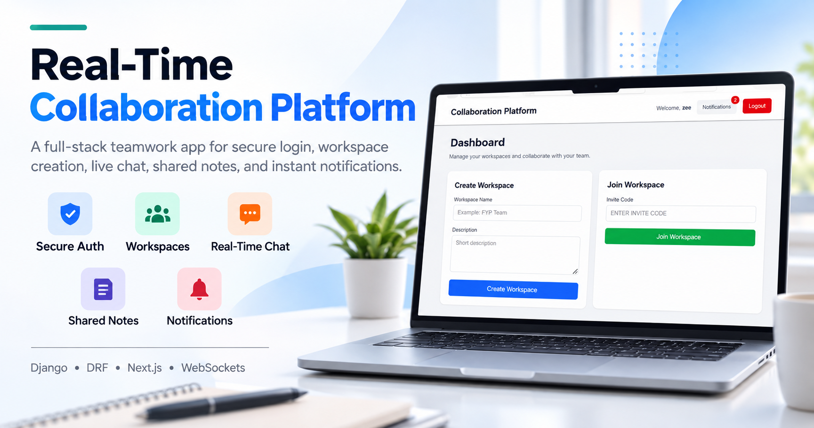
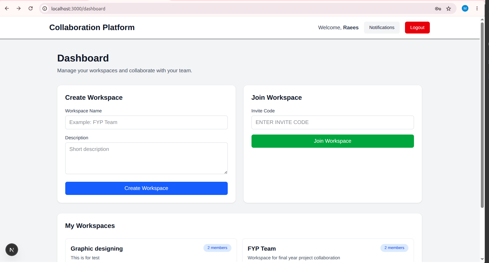
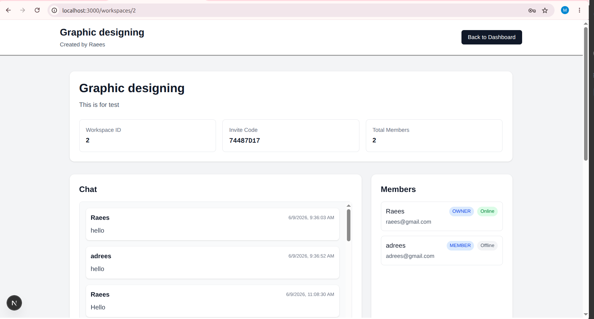

# Real-Time Collaboration Platform

A full-stack real-time collaboration platform built with **Django**, **Django REST Framework**, **Django Channels**, and **Next.js**. The application allows teams to create shared workspaces, communicate through real-time chat, manage collaborative notes, receive live notifications, and view online/offline member presence.


---

## Table of Contents

- [Project Overview](#project-overview)
- [Key Features](#key-features)
- [Tech Stack](#tech-stack)
- [System Architecture](#system-architecture)
- [Project Structure](#project-structure)
- [Backend Setup](#backend-setup)
- [Frontend Setup](#frontend-setup)
- [Environment Variables](#environment-variables)
- [API Modules](#api-modules)
- [Real-Time Communication](#real-time-communication)
- [How to Test the Project](#how-to-test-the-project)
- [Screenshots](#screenshots)
- [Author](#author)

---

## Project Overview

The **Real-Time Collaboration Platform** is designed for teams that need a simple and interactive system for communication and shared work. Users can register, log in, create or join workspaces, chat with members, create and update shared notes, and receive real-time notifications without refreshing the page.

The project focuses on full-stack integration, real-time communication, clean user experience, and modular backend architecture.

---

## Key Features

### User Authentication

- User registration
- User login
- User logout
- JWT-based authentication
- Protected frontend routes
- Current logged-in user profile API

### Workspace Management

- Create workspaces
- Join workspaces using invite code
- View workspace details
- View workspace members
- Each workspace works as a separate collaboration environment

### Real-Time Chat

- Send messages inside a workspace
- Receive messages instantly without page refresh
- Messages include sender, content, and timestamp
- WebSocket-based real-time message delivery

### Shared Notes

- Create shared notes inside a workspace
- Edit notes
- Delete notes
- View notes list
- Scrollable notes list for large note collections
- Real-time note updates across connected users

### Notifications

- Real-time notification alerts
- Notification dropdown
- Unread notification count
- Mark single notification as read
- Mark all notifications as read
- Notifications for workspace activity, chat messages, and notes activity

### Online / Offline Presence

- Show workspace members as online or offline
- Presence updates in real time
- Status changes when users connect or disconnect from a workspace

---

## Tech Stack

### Backend

- Python
- Django
- Django REST Framework
- Django Channels
- Daphne ASGI server
- Simple JWT authentication
- SQLite for local development

### Frontend

- Next.js
- React
- TypeScript
- Tailwind CSS
- Axios
- WebSocket API

### Real-Time Layer

- Django Channels
- WebSocket consumers
- ASGI routing
- In-memory channel layer for local development

---

## System Architecture

The project is divided into two main layers:

```text
Frontend: Next.js
    |
    | REST APIs + WebSockets
    |
Backend: Django + DRF + Django Channels
    |
    |
Database: SQLite
```

### Backend Modules

```text
accounts        -> Authentication and user profile
workspaces      -> Workspace creation, joining, and members
chat            -> Chat messages and chat WebSocket
notes           -> Shared notes and notes WebSocket
notifications   -> Notification API and notification WebSocket
```

### Frontend Pages

```text
/register              -> User registration page
/login                 -> User login page
/dashboard             -> Workspace dashboard and notifications
/workspaces/[id]       -> Workspace detail, chat, notes, and member presence
```

---

## Project Structure

```text
real-time-collaboration-platform/
│
├── backend/
│   ├── accounts/
│   ├── chat/
│   ├── config/
│   ├── notes/
│   ├── notifications/
│   ├── workspaces/
│   ├── manage.py
│   └── requirements.txt
│
├── frontend/
│   ├── src/
│   │   ├── app/
│   │   ├── services/
│   │   └── types/
│   ├── package.json
│   └── .env.local
│
└── README.md
```

---

## Backend Setup

Go to the backend folder:

```bash
cd backend
```

Create and activate virtual environment:

```bash
python3 -m venv venv
source venv/bin/activate
```

Install dependencies:

```bash
pip install django djangorestframework djangorestframework-simplejwt django-cors-headers channels daphne
```

Run migrations:

```bash
python manage.py makemigrations
python manage.py migrate
```

Start backend server:

```bash
python manage.py runserver
```

Backend will run at:

```text
http://127.0.0.1:8000/
```

---

## Frontend Setup

Go to the frontend folder:

```bash
cd frontend
```

Install dependencies:

```bash
npm install
```

Start frontend development server:

```bash
npm run dev
```

Frontend will run at:

```text
http://localhost:3000/
```

---

## Environment Variables

Create this file in the frontend folder:

```text
frontend/.env.local
```

Add:

```env
NEXT_PUBLIC_API_BASE_URL=http://127.0.0.1:8000/api/
```

---

## API Modules

### Authentication APIs

```text
POST    /api/auth/register/
POST    /api/auth/login/
POST    /api/auth/token/refresh/
GET     /api/auth/me/
```

### Workspace APIs

```text
GET     /api/workspaces/
POST    /api/workspaces/
POST    /api/workspaces/join/
GET     /api/workspaces/<workspace_id>/
```

### Chat APIs

```text
GET     /api/chat/workspaces/<workspace_id>/messages/
POST    /api/chat/workspaces/<workspace_id>/messages/
```

### Notes APIs

```text
GET     /api/notes/workspaces/<workspace_id>/notes/
POST    /api/notes/workspaces/<workspace_id>/notes/
GET     /api/notes/notes/<note_id>/
PUT     /api/notes/notes/<note_id>/
DELETE  /api/notes/notes/<note_id>/
```

### Notification APIs

```text
GET     /api/notifications/
POST    /api/notifications/<notification_id>/read/
POST    /api/notifications/read-all/
```

---

## Real-Time Communication

This project uses WebSockets through **Django Channels**.

### Chat WebSocket

```text
ws://127.0.0.1:8000/ws/chat/<workspace_id>/?token=<access_token>
```

Used for:

- Sending real-time chat messages
- Receiving real-time chat messages
- Online/offline user presence

### Notes WebSocket

```text
ws://127.0.0.1:8000/ws/notes/<workspace_id>/?token=<access_token>
```

Used for:

- Real-time note creation updates
- Real-time note update events
- Real-time note delete events

### Notification WebSocket

```text
ws://127.0.0.1:8000/ws/notifications/?token=<access_token>
```

Used for:

- Real-time notification alerts
- Live notification badge updates
- Notification popup alerts

---

## How to Test the Project

To test real-time features, open the project in two different browsers or one normal window and one incognito window.

### Test Flow

1. Register or log in with User 1.
2. Create a workspace.
3. Copy the workspace invite code.
4. Register or log in with User 2.
5. Join the workspace using the invite code.
6. Open the same workspace with both users.
7. Send a chat message from User 1.
8. User 2 should receive the message instantly.
9. Create or update a note.
10. The other user should see the note update without refreshing.
11. Check the notification dropdown.
12. Check online/offline member status.

---

## Screenshots

Add project screenshots here before submission.

Suggested screenshots:

```text
1. Login page
2. Register page
3. Dashboard
4. Workspace page
5. Real-time chat
6. Shared notes editor
7. Notification dropdown
8. Online/offline member status
```

Example:

```markdown


```

---

## Code Quality

The project follows a modular structure:

- Separate Django apps for each backend feature
- Separate frontend service files for API calls
- TypeScript interfaces for frontend data types
- JWT-based protected API access
- Component-based frontend structure
- WebSocket consumers separated by feature

---

## Author

**Muhammad Zeeshan**

Full-Stack Developer

GitHub: `@muhammadzeeshanlilla`

---

## License

This project is created for academic and learning purposes.
